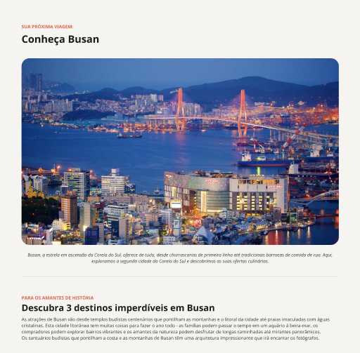

<h1>Página de Local Turístico</h1>

Esse é um dos projetos que realizei junto com o curso da RocketSeat com objetivo de aprender 
  HTML e aplicar estilos com CSS. Fique a vontade para explorar o código e sugerir melhorias.

 
  
